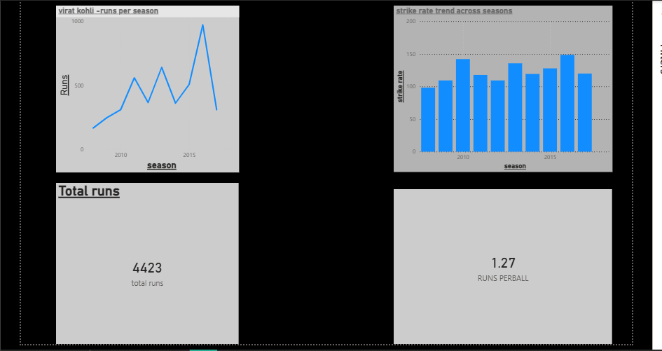

# IPL Player Performance Analysis

## Project Overview
This project focuses on analyzing IPL player performance (virat kohli)using data analysis techniques.
The goal is to evaluate player consistency, strike rate, and overall impact using Python and Power BI.

## Tools & Technologies
- Python (Pandas, NumPy, Matplotlib, Seaborn)
- Jupyter Notebook
- Git & GitHub
- Power BI (for dashboard visualization)

## Dataset
The analysis uses IPL ball-by-ball and match-level datasets.

## Project Structure
- data/ → Raw and processed datasets
- notebooks/ → Data analysis notebooks
- visuals/ → Exported charts
- powerbi/ → Power BI dashboard
- README.md → Project documentation

## Status
The analysis is concluded and the Power BI dashboard is ready for visualization.

## key insights 
hence, virat kohli has a consistent performance in the IPL, with a strike rate of 120.24 and an average of 50.64 runs. with total run of 4423 and with the average stike rate of 126.59 and 1.27 runs per ball
which show his aggresive approach in the IPL.
(The data set contain ipl 2008 to 2017 data so the data may be innacurate accding to todays time data)

